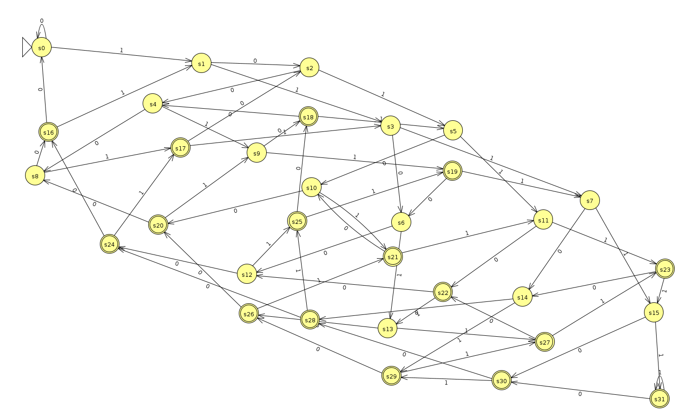
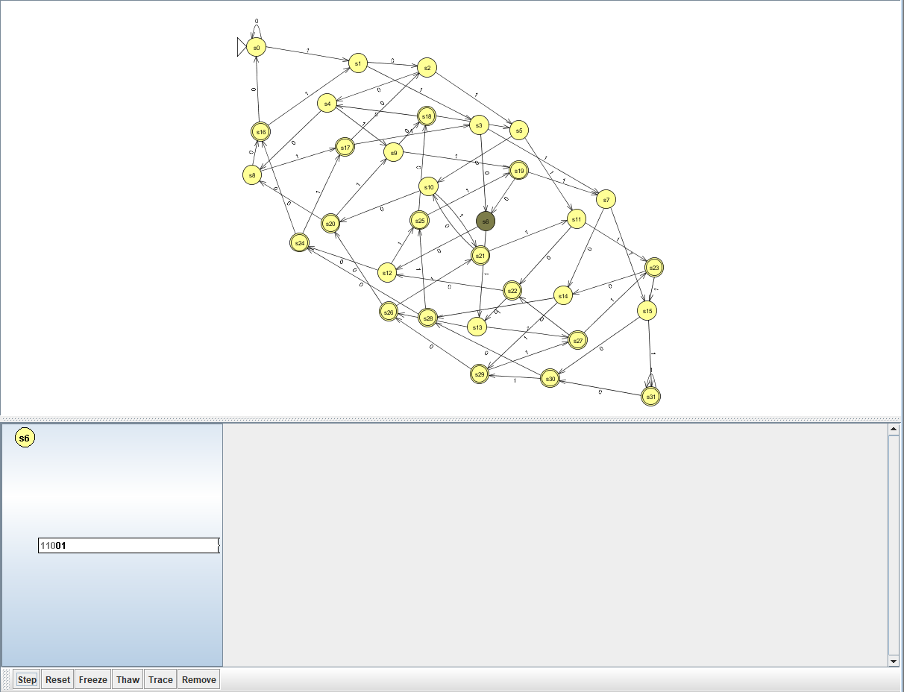
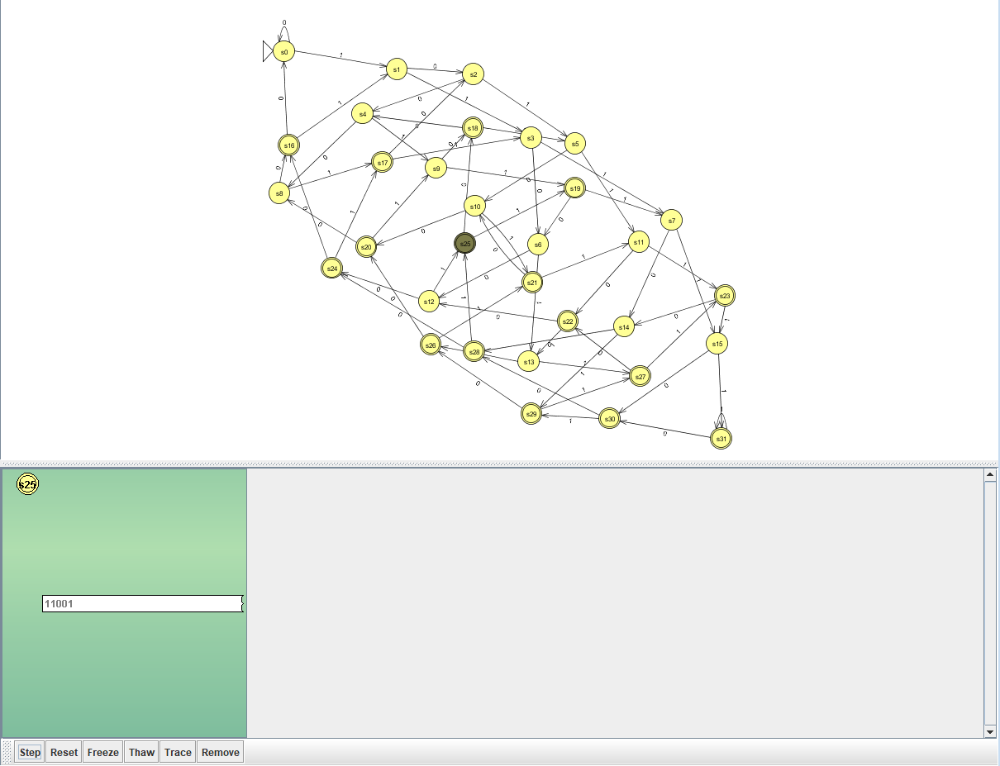
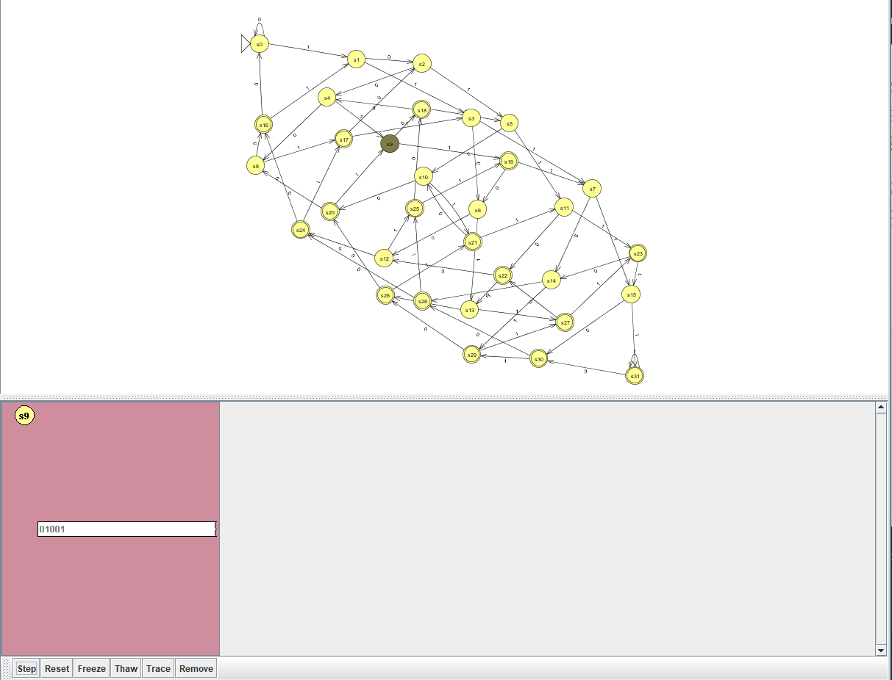
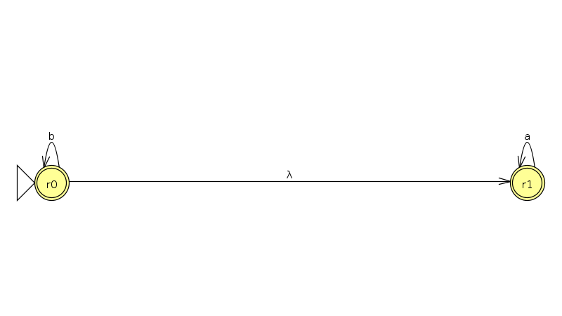
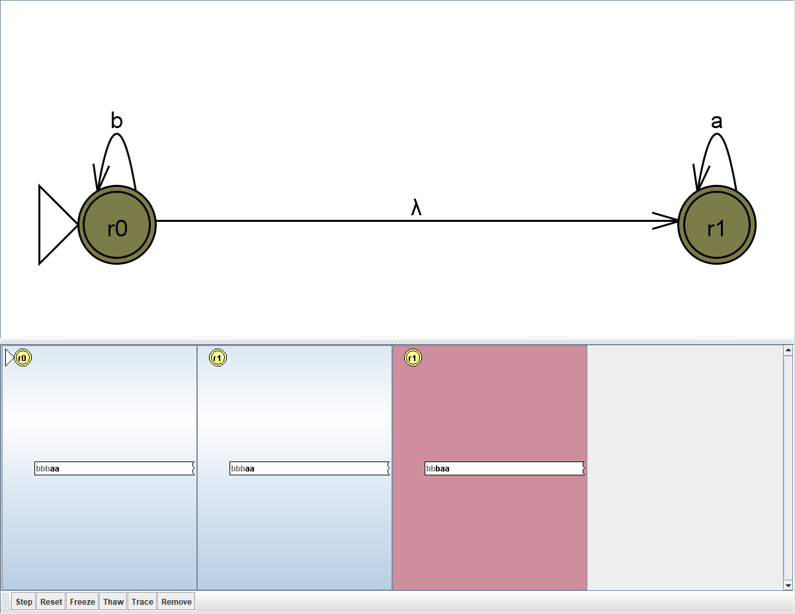
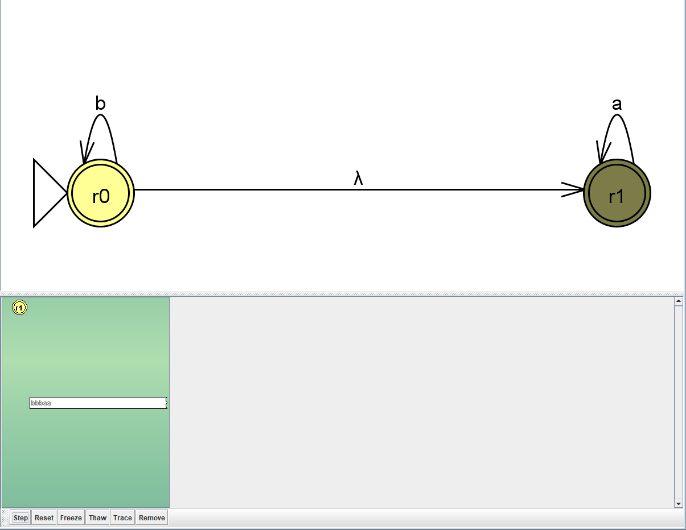
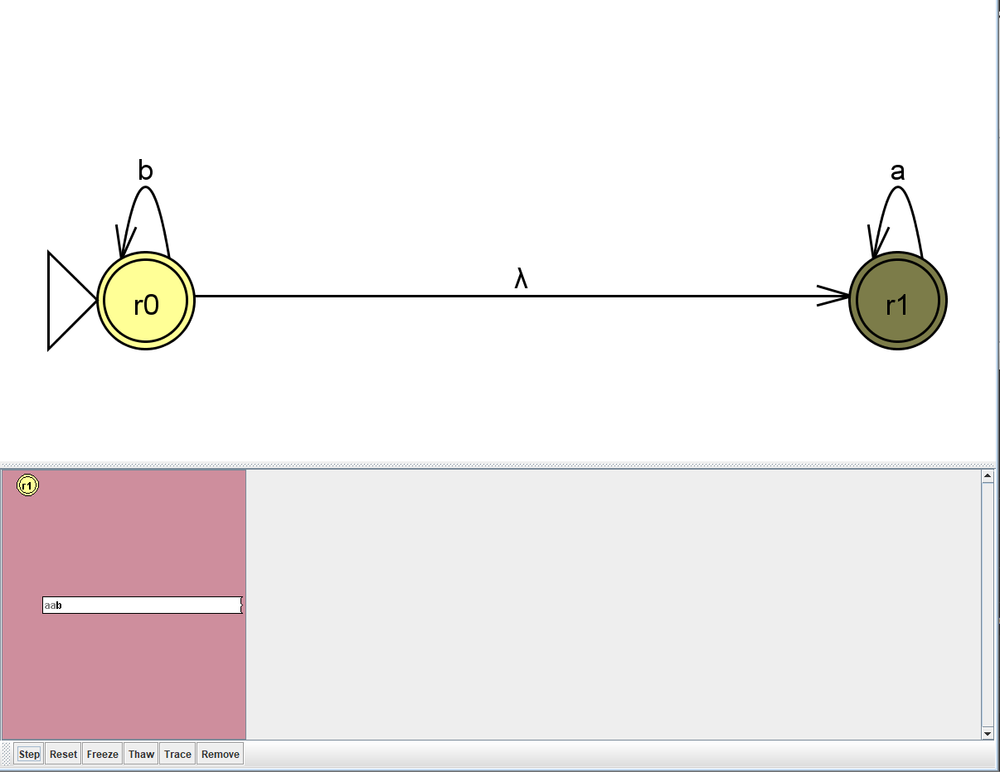

# Практическая работа № 1. Конечные автоматы

**Дисциплина:** Теория автоматов, языков и вычислений  
**Вариант:** 6  
**Выполнила:** Греб Д.С., КИ24-16/2Б  
**Проверил:** Кузнецов А.С.  
**Город, год:** Красноярск, 2026 

## 1. Цель и задание

Цель работы — построить ДКА и НКА в JFLAP, реализовать те же переходы в Java и проверить распознавание цепочек.

Мой вариант:

1. **ДКА:** над алфавитом $\{0,1\}$ принимать цепочки, в которых пятый символ **считая справа** равен `1`.
2. **НКА:** не более трёх состояний для языка

$$
L=\{a^{n}\mid n\geqslant 1\}\cup
\{b^{m}a^{k}\mid m,k\geqslant 0\}.
$$

## 2. Теоретическая часть

Конечный автомат задаётся пятёркой

$$
M=(Q,\Sigma,\delta,q_0,F),
$$

где $Q$ — множество состояний, $\Sigma$ — входной алфавит, $\delta$ — функция переходов, $q_0$ — начальное состояние, $F$ — множество допускающих состояний. Для ДКА $\delta:Q\times\Sigma\to Q$, поэтому в каждый момент активно одно состояние. Для НКА $\delta:Q\times(\Sigma\cup\{\varepsilon\})\to\mathcal{P}(Q)$, поэтому может быть активно несколько состояний, а переход по $\varepsilon$ не расходует символ входа. Цепочка принимается, когда вся она прочитана и хотя бы одно текущее состояние допускающее.

## 3. Задание а) ДКА

### Шаг 1. Состояния

Пока читаем цепочку, сохраняем пять последних битов. Состояние $s_i$ означает двоичную пятёрку, числовое значение которой равно $i$. Например, $s_3$ соответствует `00011`, $s_{25}$ — `11001`. Слева для коротких цепочек мысленно дописываются нули.

Всего возможных пятёрок $2^5=32$, поэтому $Q_D=\{s_0,s_1,\ldots,s_{31}\}$. Начальное состояние $s_0$ соответствует `00000`.

### Шаг 2. Таблица переходов и допускающие состояния

Чтение нового бита сдвигает сохранённую пятёрку влево. Самый левый бит теряется:

$$
\delta_D(s_i,c)=s_{(2i+c)\bmod 32},\qquad c\in\{0,1\}.
$$

| Текущее состояние | По `0` | По `1` | Допускает? |
|---|---|---|---|
| $s_0$ (`00000`) | $s_0$ | $s_1$ | нет |
| $s_3$ (`00011`) | $s_6$ | $s_7$ | нет |
| $s_{16}$ (`10000`) | $s_0$ | $s_1$ | да |
| $s_{25}$ (`11001`) | $s_{18}$ | $s_{19}$ | да |

Полная таблица из 32 строк строится по формуле и используется в программе `DFA.java`. Пятый бит справа — левый бит хранимой пятёрки. Он равен `1` у состояний

$$
F_D=\{s_{16},s_{17},\ldots,s_{31}\}.
$$

Получили автомат $M_D=(Q_D,\{0,1\},\delta_D,s_0,F_D)$. Каждая пара "состояние, символ" имеет ровно один переход. Если цепочка короче пяти символов, добавленные слева нули обеспечивают её отклонение.

### Шаг 3. Граф в JFLAP



На графе 32 состояния и по два перехода из каждого, поэтому стрелки пересекаются. Для чтения отдельных переходов служит формула и таблица.

### Шаг 4. Перехваты экрана при пошаговом распознавании

Проверка выполнена через `Input → Step with Closure`. При каждом нажатии `Step` JFLAP считывает один символ и показывает текущее состояние в нижней части окна.

Для цепочки `11001` последовательность переходов имеет вид

$$
s_0\xrightarrow{1}s_1\xrightarrow{1}s_3\xrightarrow{0}s_6
\xrightarrow{0}s_{12}\xrightarrow{1}s_{25}.
$$

После чтения первых трёх символов активно состояние $s_6$:



После чтения всей цепочки активно допускающее состояние $s_{25}$, поэтому цепочка принимается:



Для цепочки `01001` автомат приходит в недопускающее состояние $s_9$, поэтому цепочка отклоняется:



## 4. Задание б) НКА

### Шаг 1. Упростить запись языка

Каждая цепочка $a^{n}$ из первой части уже содержится во второй: можно взять $m=0$ и $k=n$. Поэтому

$$
L=\{b^{m}a^{k}\mid m,k\geqslant 0\}=b^{*}a^{*}.
$$

То есть сначала допустимы символы `b`, затем символы `a`. После первого `a` читать `b` уже нельзя. Пустая цепочка тоже входит в язык: $m=k=0$.

### Шаг 2. Два состояния и таблица

$r_0$ — пока читаем `b`; $r_1$ — перешли к чтению `a`. Оба состояния допускающие. Переход $r_0\xrightarrow{\varepsilon}r_1$ позволяет начать блок `a` в любой момент, даже перед первым символом.

| Состояние | `a` | `b` | $\varepsilon$ | Допускает? |
|---|---|---|---|---|
| $r_0$ — начальное | $\varnothing$ | $\{r_0\}$ | $\{r_1\}$ | да |
| $r_1$ | $\{r_1\}$ | $\varnothing$ | $\varnothing$ | да |

Формально $M_N=(\{r_0,r_1\},\{a,b\},\Delta,r_0,\{r_0,r_1\})$. Это НКА с двумя состояниями. Его начальное $\varepsilon$-замыкание равно $\{r_0,r_1\}$: можно остаться в $r_0$ или перейти в $r_1$ без чтения входа.

### Шаг 3. Граф в JFLAP



Над прямой стрелкой JFLAP показывает $\lambda$ — обозначение того же пустого перехода $\varepsilon$.

### Шаг 4. Перехваты экрана при пошаговом распознавании

Для цепочки `bbbaa` после учёта $\varepsilon$-перехода множества состояний изменяются так:

$$
\{r_0,r_1\}\xrightarrow{b}\{r_0,r_1\}
\xrightarrow{b}\{r_0,r_1\}\xrightarrow{b}\{r_0,r_1\}
\xrightarrow{a}\{r_1\}\xrightarrow{a}\{r_1\}.
$$

Промежуточный шаг распознавания цепочки `bbbaa`:



После чтения всей цепочки остаётся допускающая ветвь в $r_1$, поэтому цепочка принимается:



Для цепочки `aab` после последнего символа множество текущих состояний становится пустым, поэтому цепочка отклоняется:



## 5. Программы и сравнение результатов

В обеих программах формальная пятёрка автомата представлена отдельными сущностями:

| Элемент автомата | Смысл | Поле в Java |
|---|---|---|
| $Q$ | множество состояний | `Q` |
| $\Sigma$ | входной алфавит | `SIGMA` |
| $\delta$ | табличная функция переходов | `DELTA` |
| $q_0$ | начальное состояние | `Q0` |
| $F$ | множество допускающих состояний | `F` |

`DFA.java` хранит переходы в двумерном массиве `DELTA[состояние][символ]`. `NFA.java` использует таблицу `DELTA[откуда][a, b или ε][куда]` и массив текущих состояний. Процедура `step` выполняет один шаг НКА по таблице переходов. В программе НКА также выводятся текущие множества состояний и таблица переходов.

Символы читаются по одному через `System.in.read()`, функции обработки строк не используются. Специальные сообщения об ошибке для символов вне алфавита не выводятся. Если для символа нет перехода, цепочка получает результат `Reject`, как при моделировании в JFLAP.

| Автомат | Цепочка | Java | JFLAP |
|---|---|---|---|
| ДКА | `11001` | Accept | Accept |
| ДКА | `01001` | Reject | Reject |
| ДКА | `1111` | Reject | Reject |
| ДКА | `011001` | Accept | Accept |
| НКА | $\varepsilon$ | Accept | Accept |
| НКА | `bbbaa` | Accept | Accept |
| НКА | `aab` | Reject | Reject |
| НКА | `bbb` | Accept | Accept |

**Вывод.** ДКА проверяет пятый символ справа с помощью сдвига пяти битов. НКА с пустым переходом распознаёт $b^{*}a^{*}$. Программы и JFLAP принимают и отвергают одинаковые проверенные цепочки.

## 6. Как запустить программу
**Какие файлы здесь лежат:** `README.md` — отчёт; `DFA.jff`, `NFA.jff` — схемы JFLAP; `DFA.java`, `NFA.java` — исходные программы; папка `images` — графы автоматов и перехваты экрана пошагового распознавания.

### Запуск Java-программ
1. Откройте терминал в папке с файлами.
2. Скомпилируйте программы:

```bash
  javac -encoding UTF-8 DFA.java NFA.java
```

3. Запустите нужный автомат:
```bash 
  java DFA
```
```bash 
  java NFA
```
4. Введите цепочку и нажмите Enter. Программа выведет Accept или Reject.

### Запуск в JFLAP 

1. В JFLAP нажать `File → Open` и выбрать `DFA.jff` или `NFA.jff`. Двойной кружок — допускающее состояние, стрелка слева — начальное.
2. Для проверки одной цепочки открыть `Input → Step with Closure`, ввести, например, `11001`, затем последовательно нажимать `Step`. Цвет результата внизу: зелёный — принятие, красный — отклонение. Для нескольких цепочек удобно `Input → Multiple Run`.
