# Практическая работа № 2. Регулярные выражения, грамматики и языки

**Дисциплина:** Теория автоматов, языков и вычислений  
**Вариант:** 9  
**Выполнила:** Греб Д.С., КИ24-16/2Б  
**Проверил:** Кузнецов А.С.  
**Город, год:** Красноярск, 2026

## 1. Цель работы и постановка задачи

**Цель работы** — реализовать и исследовать регулярные выражения и регулярные грамматики, получить эквивалентные им конечные автоматы, а также с использованием леммы о разрастании доказать непринадлежность заданного языка классу регулярных языков.

**Вариант 9.**

Для частей 1 и 2 задан язык $L_9$ над алфавитом $\{a,b,c\}$, в котором каждая строка содержит **ровно одну** литеру `a`:

$$
L_9=\{w\in\{a,b,c\}^*\mid |w|_a=1\}.
$$

Необходимо:

1. построить регулярное выражение, описывающее язык $L_9$;
2. выполнить в JFLAP пошаговое преобразование регулярного выражения в конечный автомат;
3. построить регулярную грамматику для языка $L_9$;
4. выполнить в JFLAP преобразование регулярной грамматики в конечный автомат и получить эквивалентное регулярное выражение.

Для части 3 задан язык

$$
L_{35}=\{w\overline{w}\mid w\in\{0,1\}^*\},
$$

где $\overline{w}$ получается из $w$ заменой каждого `0` на `1`, а каждого `1` на `0`. Необходимо с использованием леммы о разрастании определить принадлежность или непринадлежность этого языка классу регулярных языков.

## 2. Полученное регулярное выражение

В строке языка $L_9$ должна присутствовать ровно одна буква `a`. До неё может находиться произвольное количество символов `b` и `c`, и после неё также может находиться произвольное количество символов `b` и `c`.

Поэтому регулярное выражение имеет вид:

```text
(b+c)*a(b+c)*
```

Здесь `b+c` означает выбор между символами `b` и `c`; `(b+c)*` задаёт произвольную, в том числе пустую, последовательность из `b` и `c`; символ `a` находится между двумя такими блоками и встречается ровно один раз.

Таким образом, выражение не допускает строк без `a` и строк с двумя или более символами `a`.

Для работы используется JFLAP-файл `regex.jff`.

## 3. Перехваты экранов при пошаговом преобразовании РВ в КА

В JFLAP регулярное выражение преобразуется командой `Convert -> Convert to NFA`. Исходное выражение сначала рассматривается как метка перехода обобщённого графа переходов, после чего при последовательном выполнении шагов преобразования устраняются операторы верхнего уровня.

### 3.1. Исходный обобщённый граф переходов

Создаются начальное состояние `q0`, заключительное состояние `q1` и переход между ними, помеченный всем выражением `(b+c)*a(b+c)*`.

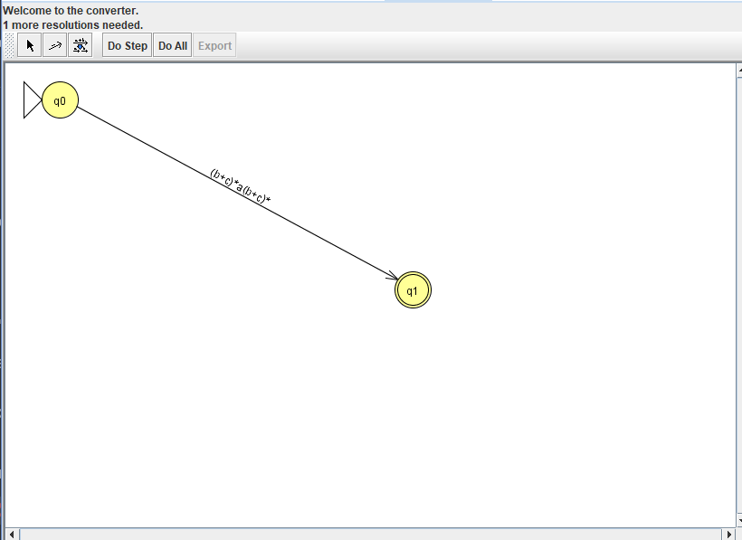

### 3.2. Устранение конкатенации

Оператором верхнего уровня является конкатенация трёх частей:

```text
(b+c)*    a    (b+c)*
```

Эти части располагаются последовательно и соединяются $\varepsilon$-переходами.

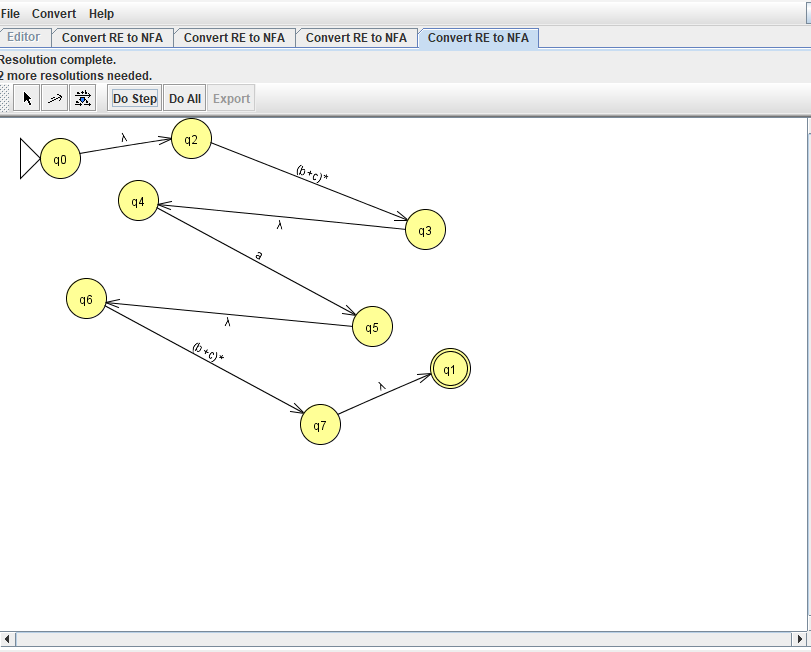

### 3.3. Раскрытие левой звёздочки Клини

Для левого подвыражения `(b+c)*` создаётся конструкция, позволяющая выполнить ноль или любое количество повторений выражения `b+c`.

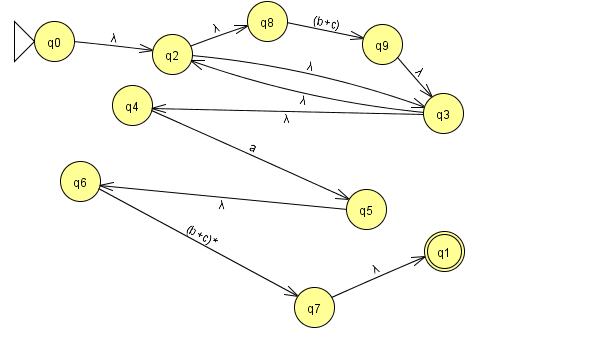

### 3.4. Раскрытие правой звёздочки Клини

Аналогично левой части преобразуется второе подвыражение `(b+c)*`, расположенное после единственного символа `a`.

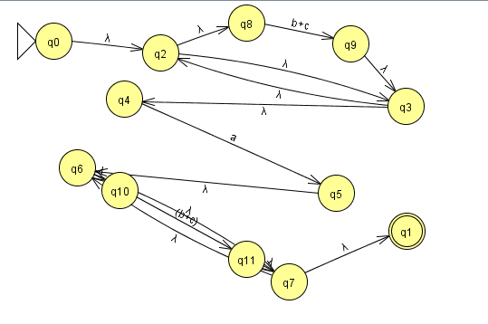

### 3.5. Раскрытие левого объединения `b+c`

После раскрытия итераций подвыражение `b+c` заменяется двумя альтернативными ветвями: одна читает `b`, другая — `c`.

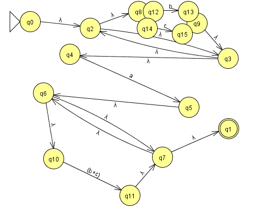

### 3.6. Итоговый $\varepsilon$-НКА

После раскрытия последнего объединения на переходах остаются только отдельные символы и $\varepsilon$-переходы. Полученный граф является конечным автоматом, эквивалентным исходному регулярному выражению.

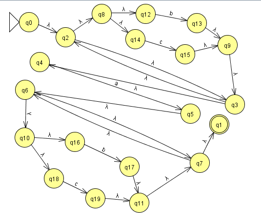


## 4. Полученная регулярная грамматика и эквивалентное ей РВ

Построим праволинейную регулярную грамматику

$$
G=(V,T,P,S),
$$

где

```text
V = {S, A}
T = {a, b, c}
```

`S` — начальный символ.

Множество правил $P$:

```text
S -> bS
S -> cS
S -> aA
A -> bA
A -> cA
A -> ε
```

Смысл нетерминалов следующий. В состоянии `S` символ `a` ещё не был порождён, поэтому можно сколько угодно раз порождать `b` и `c`. Правило `S -> aA` порождает единственный обязательный символ `a` и переводит вывод в нетерминал `A`. После этого правила `A -> bA` и `A -> cA` позволяют порождать только `b` и `c`, а `A -> ε` завершает вывод.

Пример вывода строки `cbab`:

```text
S => cS => cbS => cbaA => cbabA => cbab
```

Грамматика является праволинейной и задаёт тот же язык $L_9$.

Эквивалентное ей регулярное выражение:

```text
(b+c)*a(b+c)*
```

Для работы используется JFLAP-файл `regular_grammar.jff`.

## 5. Перехваты экранов при пошаговом преобразовании РГ в КА и РВ

### 5.1. Исходная регулярная грамматика

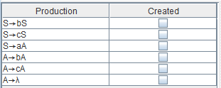

### 5.2. Преобразование правил из `S` в переходы КА

Правила

```text
S -> bS
S -> cS
S -> aA
```

задают циклы по `b` и `c` в состоянии `S` и переход по `a` из состояния `S` в состояние `A`.

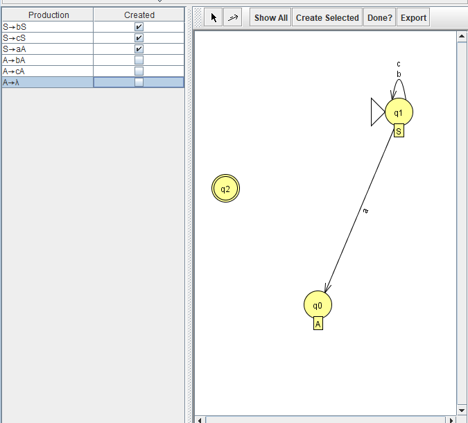

### 5.3. Итоговый КА, полученный из грамматики

Правила

```text
A -> bA
A -> cA
A -> ε
```

задают циклы по `b` и `c` в состоянии `A`. Для правила `A -> ε` JFLAP создаёт отдельное заключительное состояние и $\varepsilon$-переход из состояния `A` в него. Поэтому после чтения единственной `a` цепочка может быть завершена, а дальнейшие `b` и `c` допускаются циклами в `A`.

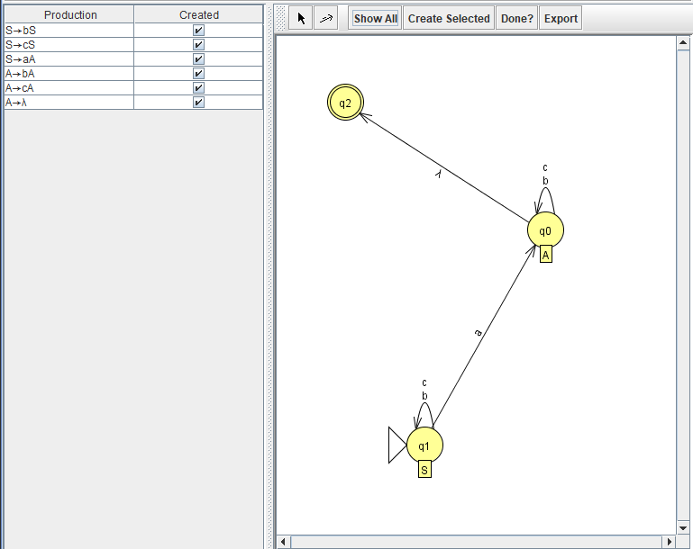

Полученный автомат допускает те и только те строки, которые содержат ровно один символ `a`.

### 5.4. Подготовка КА к преобразованию в РВ

Полученный КА рассматривается как обобщённый граф переходов. Сначала параллельные переходы по `b` и `c` объединяются в один переход с меткой `b+c`. Для пар состояний, между которыми переход отсутствует, JFLAP добавляет переходы по пустому множеству $\varnothing$; это не $\varepsilon$-переходы и они не соответствуют чтению пустой строки.

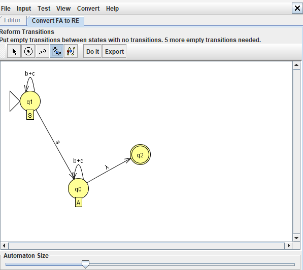

После подготовки графа удаляется промежуточное состояние `A`. При сворачивании состояния метки оставшихся переходов пересчитываются так, чтобы язык графа не изменился. Путь через `A` учитывает переход по `a`, любое число повторений цикла `b+c` и последующий $\varepsilon$-переход в заключительное состояние.

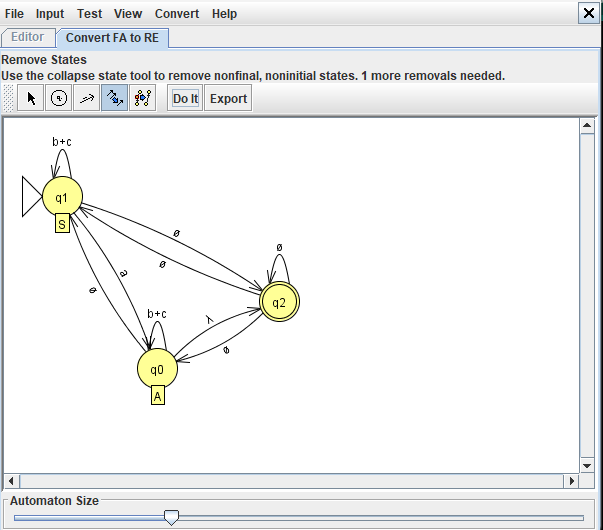

### 5.5. Итоговое РВ

```text
(b+c)*a(b+c)*
```

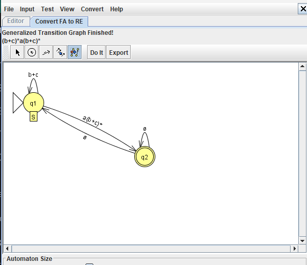

Полученное выражение совпадает с РВ из раздела 2, следовательно, регулярное выражение и регулярная грамматика задают один и тот же язык.

## 6. Формальное доказательство непринадлежности языка к классу РЯ

Рассматривается язык

$$
L_{35}=\{w\overline{w}\mid w\in\{0,1\}^*\}.
$$

Например, если

```text
w  = 00101,
w̄ = 11010,
```

то

```text
ww̄ = 0010111010.
```

Докажем, что $L_{35}$ не является регулярным, используя лемму о разрастании для регулярных языков.

### 6.1. Предположение

Предположим противное: язык $L_{35}$ регулярный. Тогда существует число разрастания $p$ такое, что любую строку $s\in L_{35}$ длины не меньше $p$ можно представить в виде

$$
s=xyz,
$$

где

$$
|xy|\le p,\qquad |y|>0,
$$

и для любого $i\ge 0$ строка $xy^iz$ также должна принадлежать $L_{35}$.

### 6.2. Выбор строки

Возьмём

$$
w=0^p.
$$

Тогда

$$
\overline{w}=1^p,
$$

поэтому строка

$$
s=0^p1^p
$$

принадлежит $L_{35}$.

### 6.3. Рассмотрение произвольного допустимого разбиения

Так как $|xy|\le p$, части `x` и `y` целиком расположены внутри первых $p$ символов строки $s$. Все эти символы равны `0`.

Следовательно,

$$
y=0^k,
$$

где $k\ge1$.

### 6.4. Нарушение условия леммы

Возьмём $i=0$, то есть удалим часть `y`. Получим

$$
xy^0z=xz=0^{p-k}1^p.
$$

В любой строке вида $u\overline{u}$ общее количество нулей равно общему количеству единиц: каждый символ первой половины дополняется противоположным символом во второй половине.

В строке $0^{p-k}1^p$ количество нулей равно $p-k$, а количество единиц равно $p$. Поскольку $k\ge1$, эти числа различны. Значит,

$$
0^{p-k}1^p\notin L_{35}.
$$

Получено противоречие с леммой о разрастании, согласно которой строка $xy^iz$ должна принадлежать языку для любого $i\ge0$.

Следовательно, предположение о регулярности языка неверно.

**Итог:** язык $L_{35}$ не принадлежит классу регулярных языков.


## 7. Проверка тестовых цепочек в JFLAP

Проверка итогового $\varepsilon$-НКА выполнена в JFLAP в режиме `Input -> Multiple Run`.

| Цепочка | Результат | Объяснение |
|---|---|---|
| `a` | Accept | ровно один `a` |
| `ba` | Accept | ровно один `a` |
| `ac` | Accept | ровно один `a` |
| `cbabcc` | Accept | ровно один `a` |
| `bbb` | Reject | символа `a` нет |
| `aaa` | Reject | три символа `a` |
| `cabac` | Reject | два символа `a` |

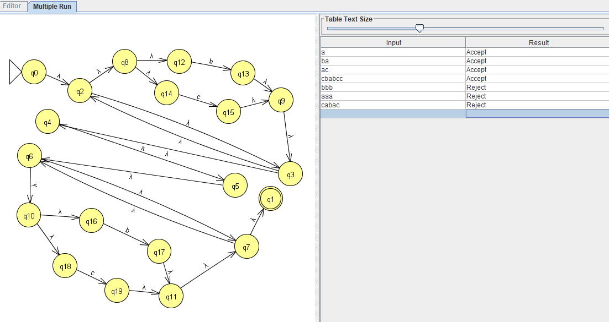

## 8. Вывод

В ходе практической работы для языка над алфавитом $\{a,b,c\}$, содержащего ровно один символ `a`, было построено регулярное выражение

```text
(b+c)*a(b+c)*
```

и показано его пошаговое преобразование в конечный автомат. Также построена праволинейная регулярная грамматика и показано её преобразование в эквивалентный конечный автомат и регулярное выражение. Полученные представления задают один и тот же регулярный язык.

Для языка $L_{35}=\{w\overline{w}\}$ с помощью леммы о разрастании получено противоречие, поэтому этот язык не является регулярным.

## 9. Как открыть и проверить работу в JFLAP

В работе используются два JFLAP-файла: `regex.jff` и `regular_grammar.jff`.

### 9.1. Регулярное выражение

1. Запустить JFLAP и открыть файл `regex.jff`.
2. Проверить выражение `(b+c)*a(b+c)*`.
3. Выбрать `Convert -> Convert to NFA`.
4. Выполнить пошаговое преобразование до получения конечного автомата.
5. Открыть полученный автомат и выполнить проверку цепочек через `Input -> Multiple Run`.

### 9.2. Регулярная грамматика

1. Открыть файл `regular_grammar.jff`.
2. Проверить наличие правил `S -> bS | cS | aA` и `A -> bA | cA | ε`.
3. Выполнить `Convert -> Convert Right-Linear Grammar to FA`.
4. После построения КА экспортировать его в отдельное окно.
5. Выполнить `Convert -> Convert FA to RE`.
6. Результатом является регулярное выражение `(b+c)*a(b+c)*`, эквивалентное исходной грамматике.
